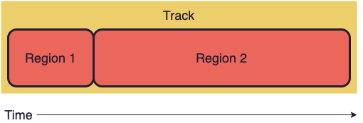
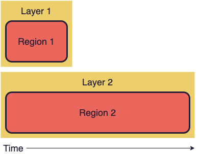

React Ensemble executes regions _sequentially_, meaning one region won't start until the one before it has finished.
If we were to configure a region to start when another region was still running, `TrackUtils.gen` would throw an error.



So what about if we want to have two regions overlap? For instance, what if we want regions one and two to start at the same time?

For executing regions _concurrently_, React Ensemble offers the concept of **track layers**.
A layer is essentially a sub-track for regions to be placed in so they can run at the same time as other sub-tracks (layers).



Layers are executed independently of one another. Therefore, if two regions are put on separate layers, they will run at the same time.

## Setting Layers

Set a region's layer by specifying a string as its `layer` property. This string is the layer's **name**. Any other regions within the track that have the same layer name will be put on the same layer.

```js
const track = [
  {
    layer: "1_movement", // Set layer
    duration: 5000,
    state: { x: { to: 10 } }
  },
  {
    // No layer prop: will be put in default layer
    start: 2500,
    duration: 1000,
    state: { y: { to: "#AAAAAA" } }
  },
  {
    layer: "1_movement", // Will start after the previous region in this layer (5 seconds)
    duration: 2000,
    state: { x: { to: 5 } }
  }
];
```

If it's easier, you can use [`TrackUtils.layer`](/docs/api/trackutils#layer) to set one or more regions' layers.
This function can take a string or a number as the layer name, which will be cast to a string.

```js
import { TrackUtils } from "react-ensemble";

const myRegions = TrackUtils.layer(1, [
  { duration: 5000, state: { x: { to: 10 } } },
  { duration: 2000, state: { x: { to: 5 } } }
]); // Returns copies of these regions where layer = "1"
```

## Working in Multiple Layers

Since layers are independent of each other, it can be easier to visualize multiple layers by using the helper function [`TrackUtils.multi`](/docs/api/trackutils#multi).

With `multi`, you can pass in layers as separate arrays or regions and they'll be converted into a regular track with layer names (based on each sub-track's index).

```js
const track = TrackUtils.multi([
  [
    { duration: 5000, state: { x: { to: 10 } } }, // Will be assigned layer = "0"
    { duration: 2000, state: { x: { to: 5 } } } // Will be assigned layer = "0"
  ],
  { start: 500, duration: 0, state: { y: { set: 100 } } } // Will be assigned layer = "1"
]);
```

Alternatively, you can pass `multi` an object with each value being one or more regions. Layers will be assigned based on each key.

```js
const track = TrackUtils.multi({
  foo: [
    { duration: 5000, state: { x: { to: 10 } } }, // Will be assigned layer = "foo"
    { duration: 2000, state: { x: { to: 5 } } } // Will be assigned layer = "foo"
  ],
  bar: { start: 500, duration: 0, state: { y: { set: 100 } } } // Will be assigned layer = "bar"
});
```

Keep in mind, `multi` is just nice syntax.
You can use all the features of layering by configuring the right properties on your track regions.
All `multi` does is add them for you.

For example, that last call to `multi` outputs this region, which is called a **group**:

```js
const track = [
  {
    regions: [
      { layer: "foo", duration: 5000, state: { x: { to: 10 } } },
      { layer: "foo", duration: 2000, state: { x: { to: 5 } } },
      { layer: "bar", start: 500, duration: 0, state: { y: { set: 100 } } }
    ]
  }
];
```

Skip to the [Groups guide](/docs/guides/groups) to learn more about groups.

## Layer Resolution

It's important to note that every layer is essentially its own animation, meaning each layer has a potential value for every state property at any given frame.

In other words, if your animation has state `{ x: number, y: string }` and multiple layers, _every layer_ will have its own value for `x` and `y` on each frame.
Obviously, we can only draw one `x` to the screen, so how do we decide which layer's `x` to use?

To solve this problem, React Ensemble uses a **layer resolver**.
This is a function that takes information about all the layers using a state property and decides which value is the right one to draw.

### A Practical Example

Consider the following track:

```js
[
  { layer: "1", duration: 0, state: { x: { set: 123 } } },
  { layer: "2", start: 500, duration: 0, state: { x: { set: 99 } } }
];
```

This animation has two layers: 1 and 2. If `x` has a default value of `0`, the following is true:

- At time = 0, `x` is changed from `0` to `123` on layer 1
- At time = 500, `x` is changed from `0` to `99` on layer 2

Since we have two layers, there are two possible `x` values we could draw at any frame of the animation.
Let's consider some possible ways to resolve this.

**First Option: Prioritize the first layer**

With this resolver, we always choose the `x` value from the first layer. Our animation would look like this:

- At time = 0, `x` is changed from `0` to `123`
- `x` remains `123` for the rest of the animation

The information from layer 2 is lost. This probably isn't the best option.

**Second Option: Prioritize the last layer**

If we always choose the `x` from the last layer instead, our animation would look like this:

- `x` is `0` until time = 500
- At time = 500, `x` is changed from `0` to `99`
- `x` remains `99` for the rest of the animation

Just like in the first option, we're losing the information from one of the layers.

**Third Option: Choose the value that's changed most recently**

With this resolver, we choose the `x` value that has changed most recently. Here's how that would look:

- At time = 0, `x` is changed from `0` to `123`
- `x` is `123` until time = 500
- At time = 500, `x` is changed from `123` to `99`
- `x` remains `99` for the rest of the animation

This is similar to how React Ensemble's default layer resolver works, as you'll see in the next section.

### The Default Layer Resolver

React Ensemble's default layer resolver is **overrideLast**, accessible at [`TrackUtils.layerResolvers.overrideLast`](/docs/api/trackutils#layerresolversoverridelast)

As hinted by its name, the **overrideLast** resolver selects the value candidate with the lowest age (least amount of time since it was last updated).

If multiple candidates have the same age, the one with the highest layer rank will be used.
Layer rank is calculated by alphanumerically sorting all layer names that exist in the track.
In other words, if there's a tie, a layer named `10` will beat a layer named `9`.

### Writing a Resolver

You can override the layer resolver for an animation by setting the `resolver` prop in your `Timeline`.

A layer resolver must match the following signature:

```ts
<T>(
  stateKey: string,
  layers: Array<{ name: string; rank: number; age: number; value: T }>
) => T;
```

`stateKey` is the name of the state property being evaluated, and `layers` contains information about the property's use in every layer.

For example, let's write a resolver that returns the **sum** of all instances of `x` across all layers.

```js
const sumXResolver = (stateKey, layers) => {
  if (stateKey !== "x") {
    // Use the default resolver if it's a different state property
    return TrackUtils.layerResolvers.overrideLast(stateKey, layers);
  }

  const total = 0;
  layers.forEach(({ value }) => (total += value));

  return total;
};
```

## Further Reading

- [TrackUtils API](/docs/api/trackutils)
- [TrackLayerResolver API](/docs/api/types#tracklayerresolver)
