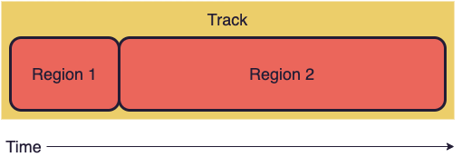
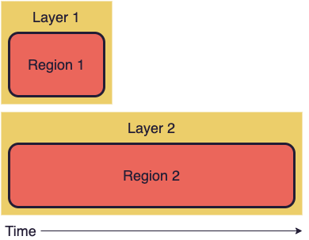

import QuickStart from "../../content/examples/quick-start.mdx";

It's super easy to start animating with React Ensemble. This guide will explain step-by-step how to create this animation:

<QuickStart />

**Note:** Most of the examples in these docs are **interactive!** Click the button above to expand this example's code playground. You can edit it to see how the animation changes right on the page!

## Part 0: Prerequisites

This tutorial assumes you have enough React experience to be comfortable creating a React application, writing function components, and using a few common React Hooks (specifically, `useState`).

If that sounds like you, feel free to [skip to the next section](#part-1-setting-the-stage). Otherwise, read on!

### Using React

React Ensemble, as the name suggests, is a component library for React. If you're unfamiliar with React (or just need to brush up on the basics!), a good starting point is the [official React guide](https://reactjs.org/docs/hello-world.html).

You don't need to be a React expert by any means to read this guide, but it may be helpful to have experience with two key React features: **function components** and **the `useState` hook**.

All the examples in this guide use React function components, rather than class components. Instead of writing our React components like this:

```jsx
class MyComponent extends React.Component {
  render() {
    const myState = this.state;
    // ...
  }
}
```

We'll be writing them as pure functions:

```jsx
const MyComponent = props => {
  const [myState, setMyState] = React.useState(defaultValue);
  // ...
};
```

If you're confused by that whole `React.useState` business, don't worry!
The `useState` function is part of the new Hooks feature in React, which lets us have state in functional components.

Here's a quick breakdown of our example:

- Calling `React.useState` returns a _value_ and a _setter_ for that specific piece of state.
- `myState` is the state's current value. By default, this will equal the `defaultValue` we passed in.
- `setMyState` is a callback function we can use when we want to update the state to a new value.

For more info on the `useState` hook, check out the [React docs](https://reactjs.org/docs/hooks-state.html).

### Creating a New Project

You'll need a working React application to build the animation in this tutorial.
Because all the code will be in a single file, it doesn't really matter which environment you use.
You can try Create React App, an online playground, or any functioning React application.

[Create React App](https://create-react-app.dev/docs/getting-started/) (CRA) is a super quick way to start a fully functional React app from the command line. To get started, run the following:

```shell
yarn create react-app my-animation
cd my-animation
yarn start
```

After a few minutes, you should see the CRA welcome page in your browser. Go ahead and delete the contents of `src/App.js`, and you're ready to go!

## Part 1: Setting the Stage

First, let's [install](/docs/installation) React Ensemble.

```shell
yarn add react-ensemble
```

**Note:** This guide uses JavaScript for clarity, but you can also follow along in [TypeScript](https://www.typescriptlang.org/). For more information, see the guide on [using Typescript with React Ensemble](/docs/guides/using-typescript).

### The Container

Create a new file for our animation and add the following code:

```jsx
import React from "react";
import { Timeline, Controller, Lib, TrackUtils } from "react-ensemble";

const MyAnimation = () => {
  return (
    <div
      style={{
        height: 150,
        width: "100%",
        position: "relative",
        display: "flex",
        justifyContent: "center"
      }}
    >
      Hi!
    </div>
  );
};

export default MyAnimation;
```

Here's what we did:

1. Imported `Timeline`, `Controller`, `Lib`, and `TrackUtils` from React Ensemble. Don't worry, we'll explain each of these as needed.
2. Created a component that returns a [flexbox](https://css-tricks.com/snippets/css/a-guide-to-flexbox/) div. This div will contain our animation.

Running the code should render this:

```jsx live startHidden
() => {
  return (
    <div
      style={{
        height: 250,
        width: "100%",
        position: "relative",
        display: "flex",
        justifyContent: "center"
      }}
    >
      <div>Hi!</div>
    </div>
  );
};
```

### The Circle

Next, we'll add the star of our show: a circle.

```jsx live renderOnly
() => {
  return (
    <div
      style={{
        height: 150,
        width: "100%",
        position: "relative",
        display: "flex",
        justifyContent: "center"
      }}
    >
      <div
        style={{
          position: "relative",
          borderRadius: 15,
          width: 30,
          height: 30,
          backgroundColor: "__primary",
          left: 0,
          top: 35,
          opacity: 1
        }}
      />
    </div>
  );
};
```

First, replace the `<div>Hi</div>` in our component with the following div:

```jsx
<div
  style={{
    position: "relative",
    borderRadius: 15,
    width: 30,
    height: 30,
    backgroundColor: "__primary",
    left: 0,
    top: 35,
    opacity: 1
  }}
/>
```

Giving us our perfect circle:

```jsx live startHidden
() => {
  return (
    <div
      style={{
        height: 250,
        width: "100%",
        position: "relative",
        display: "flex",
        justifyContent: "center"
      }}
    >
      <div
        style={{
          position: "relative",
          borderRadius: 15,
          width: 30,
          height: 30,
          backgroundColor: "__primary",
          left: 0,
          top: 35,
          opacity: 1
        }}
      />
    </div>
  );
};
```

## Part 2: Making Things Move

In this part, we'll breathe some life into our animation.

Start by adding the `Controller` and `Timeline` components we imported earlier into your JSX, right above the container from the last part.

```jsx
const MyAnimation = () => {
  return (
    <>
      <Controller>
        {props => <Timeline {...props} defaultState={{}} track={[]} />}
      </Controller>
      <div>{/* Animation Container */}</div>
    </>
  );
};
```

What do these components do? Here's a quick summary:

### Timeline

The `Timeline` component is the engine behind our animation.
It takes our animation data as props (at a minimum, the animation's `track` and `defaultState`) and computes each frame in real time.

**Note:** `Timeline` doesn't render anything by itself. It simply returns data that we use to draw our animation.

### Controller

The `Controller` is an _optional_ component that automatically configures a `Timeline` and provides some basic UI controls for your animation.

You can animate using only the `Timeline` component if you want more control, but using a `Controller` is an easy way to get up and running right away.

### Default State

The prop `defaultState` is required by `Timeline`. It contains the starting state of your animation.

Outside your component, define your animation's default state:

```jsx
const defaultAnimState = {
  x: -250,
  opacity: 0
};
```

Then, pass your default state as a prop to your timeline:

```jsx
<Timeline {...props} defaultState={defaultAnimState} track={[]} />
```

### Drawing from Data

Next, we need to rewrite our circle from earlier to rely on our animation state. Create a `useState` hook in the component to track your animation state.

```jsx
const MyAnimation = () => {
  const [animState, setAnimState] = React.useState(defaultAnimState);
  // return ...
};
```

Remember, the `useState` syntax means that `animState` will always refer to the current state of our animation, starting with `defaultAnimState`.

Now, replace the `left` and `opacity` properties in the circle div to rely on the `x` and `opacity` properties of the animation state.

```jsx
<div
  style={{
    position: "relative",
    borderRadius: 15,
    width: 30,
    height: 30,
    backgroundColor: "__primary",
    left: animState.x, // Changed
    top: 35,
    opacity: animState.opacity // Changed
  }}
/>
```

If you look at the output of your app, you should see that the circle has disappeared. This means your animation is working! After all, you changed its opacity to zero and moved it 250px to the left.

### The Track

The final piece is the **track**, the `Timeline` prop that determines when and how our animation state changes.

A track is an array of objects called **regions**.
Each region contains a description of how certain state properties should change over a given time frame.

You can describe regions using these fields:

- `start`
- `stop`
- `duration`
- `state`
- `loop`
- [and more!](/docs/api/types#trackregion)

Lets animate our circle coming in and out of frame. Add the following code _outside_ the component:

```jsx
const track = [
  {
    duration: 1500,
    state: {
      opacity: { to: 1 },
      x: { to: 0 }
    }
  },
  {
    duration: 1500,
    state: {
      opacity: { to: 0 },
      x: { to: 250 }
    }
  }
];
```

Reading our track top-to-bottom, we can see that for the first 1.5 seconds (1500 ms), the circle's opacity will change to 1 and its x-coordinate will change to 0.
Over the next 1.5 seconds, the circle will fade back out and travel off the right side of the screen.

Finally, we'll make two additions to the timeline:

- Pass in the `track`.
- Hook up the Timeline's `onUpdate` callback to set our animation state on every frame.

```jsx
<Timeline
  {...props}
  defaultState={defaultAnimState}
  track={track}
  onUpdate={({ state }) => setAnimState(state)}
/>
```

On your live app, press play. _**It's alive!!**_

```jsx live startHidden
() => {
  ////////
  // Note: this block should be outside the component in your app
  const defaultAnimState = {
    x: -250,
    opacity: 0
  };

  const track = [
    {
      duration: 1500,
      state: {
        opacity: { to: 1 },
        x: { to: 0 }
      }
    },
    {
      duration: 1500,
      state: {
        opacity: { to: 0 },
        x: { to: 250 }
      }
    }
  ];
  // End block (the rest should be inside your component)
  ////////

  const [animState, setAnimState] = React.useState(defaultAnimState);

  return (
    <>
      <Controller>
        {props => (
          <Timeline
            {...props}
            defaultState={defaultAnimState}
            track={track}
            onUpdate={({ state }) => setAnimState(state)}
          />
        )}
      </Controller>
      <div
        style={{
          height: 250,
          width: "100%",
          position: "relative",
          display: "flex",
          justifyContent: "center"
        }}
      >
        <div
          style={{
            position: "relative",
            borderRadius: 15,
            width: 30,
            height: 30,
            backgroundColor: "__primary",
            left: animState.x,
            top: 35,
            opacity: animState.opacity
          }}
        />
      </div>
    </>
  );
};
```

## Part 3: Shape Shifting

In this part, we'll create the next section of our animation by using two utility modules exported by React Ensemble: `TrackUtils` and `Lib`.

First, add the following code _outside_ your component, right after the imports:

```jsx
const { multi } = TrackUtils;
const { d3Ease } = Lib;
```

### TrackUtils.multi

`TrackUtils` contains utility functions related to manipulating and parsing animation tracks.

The largest of these functions is `TrackUtils.gen`, which parses a track into a queryable animation object.
`Timeline` uses this function under the hood, but you can also import it yourself. For more information, see the [TrackUtils.gen docs](/docs/api/trackutils).

For this example, we'll be using `TrackUtils.multi`. Add the following code to your track, right after the first region:

```jsx
// First region goes here (circle in)
multi([
  {
    duration: 100,
    state: {
      circleMorph: { to: 0 } // Will morph the circle into a square
    }
  },
  {
    duration: 1000,
    state: {
      width: { to: 50 }
    }
  }
]),
// Last region goes here (circle out)
```

Also, you'll need to update the default state and circle div to use these new fields:

```jsx
// Outside your component:
const defaultAnimState = {
  circleMorph: 1, // New
  width: 30, // New
  x: -250,
  opacity: 0
};

// In the circle div:
<div
  style={{
    position: "relative",
    borderRadius: animState.width * animState.circleMorph * 0.5, // Changed
    width: animState.width, // Changed
    height: animState.width, // Changed
    backgroundColor: "__primary",
    left: animState.x,
    top: 35,
    opacity: animState.opacity
  }}
/>;
```

React Ensemble executes regions _sequentially_, meaning one region won't start until the one before it has finished.
If we were to configure a region to start when another region was still running, `TrackUtils.gen` would throw an error.



So what about if we want to have two regions overlap?
For instance, here the circle should morph into a square over 0.1 seconds and increase its width to 50 over 1 second.
We want both of these regions to start at the same time.

For executing regions _concurrently_, React Ensemble offers the concept of **track layers**.
A layer is essentially a sub-track for regions to be placed in so they can run at the same time as other sub-tracks (layers).



Layers are executed independently of one another. Therefore, if two regions are put on separate layers, they will run at the same time.

Our call to `TrackUtils.multi` does just that: it puts the first region into one layer and the second region into another.
When we run the code, both regions execute at the same time!

```jsx live startHidden
() => {
  ////////
  // Note: this block should be outside the component in your app
  const { multi } = TrackUtils;
  const { d3Ease } = Lib;

  const defaultAnimState = {
    circleMorph: 1,
    width: 30,
    x: -250,
    opacity: 0
  };

  const track = [
    {
      duration: 1500,
      state: {
        opacity: { to: 1 },
        x: { to: 0 }
      }
    },
    multi([
      {
        duration: 100,
        state: {
          circleMorph: { to: 0 }
        }
      },
      {
        duration: 1000,
        state: {
          width: { to: 50 }
        }
      }
    ]),
    {
      duration: 1500,
      state: {
        opacity: { to: 0 },
        x: { to: 250 }
      }
    }
  ];
  // End block (the rest should be inside your component)
  ////////

  const [animState, setAnimState] = React.useState(defaultAnimState);

  return (
    <>
      <Controller>
        {props => (
          <Timeline
            {...props}
            defaultState={defaultAnimState}
            track={track}
            onUpdate={({ state }) => setAnimState(state)}
          />
        )}
      </Controller>
      <div
        style={{
          height: 250,
          width: "100%",
          position: "relative",
          display: "flex",
          justifyContent: "center"
        }}
      >
        <div
          style={{
            position: "relative",
            borderRadius: animState.width * animState.circleMorph * 0.5, // Changed
            width: animState.width,
            height: animState.width,
            backgroundColor: "__primary",
            left: animState.x,
            top: 35,
            opacity: animState.opacity
          }}
        />
      </div>
    </>
  );
};
```

**Note:** `TrackUtils.multi` is just nice syntax.
You can use all the features of layering by configuring the right properties on your track regions.
All `multi` does is add them for you.

For example, our `multi` region is equivalent to this region, which is called a **group**.

```jsx
// This is just an example!
// You don't need to paste it into your animation.
{
  regions: [
    {
      layer: "0",
      duration: 100,
      state: {
        circleMorph: { to: 0 }
      }
    },
    {
      layer: "1",
      duration: 1000,
      state: {
        width: { to: 50 }
      }
    }
  ];
}
```

For more information on layers and groups, see the guides on [Layers](/docs/guides/layers) and [Groups](/docs/guides/groups).

### Easing with Lib.d3Ease

You may have noticed that our shape-shift animation doesn't quite match up with the example at the start of this guide.

import EaseCompare from "../../content/examples/ease-compare.mdx";

<EaseCompare />

Our square doesn't "spring" outward like the goal animation does. This is because our region's **easing function** is different.

Usually, we do not want time to be exactly linear in our animations.
An element that slides in at a constant speed is much less exciting than one that bounces, springs, or boomerangs in.
We can control this effect with an _easing function_.

Add the following line to the multi-region:

```jsx
multi([
  {
    duration: 100,
    state: {
      circleMorph: { to: 0 }
    }
  },
  {
    duration: 1000,
    state: {
      width: { to: 50 }
    },
    easing: d3Ease.easeElastic // New line!
  }
]),
```

The `easing` property on a track region sets its time curve.
Here, we are using the `easeElastic` function provided by the package [**d3-ease**](https://github.com/d3/d3-ease).
This easing function will give our shape shift an elastic feel.

[**d3-ease**](https://github.com/d3/d3-ease) includes a number of interesting easing functions.
For convenience, React Ensemble exports this package at `Lib.d3Ease`.
Check out the [Easing and Interpolating guide](/docs/guides/easing-and-interpolating) for more information.

### Shifting Back

To make the square shift back into a circle, add another group just after the first one:

```jsx
multi([
  {
    duration: 100,
    state: {
      circleMorph: { to: 1 }
    }
  },
  {
    duration: 1000,
    state: {
      width: { to: 30 }
    },
    easing: d3Ease.easeElastic
  }
]),
```

At this point, the animation should look like this:

```jsx live startHidden
() => {
  ////////
  // Note: this block should be outside the component in your app
  const { multi } = TrackUtils;
  const { d3Ease } = Lib;

  const defaultAnimState = {
    circleMorph: 1,
    width: 30,
    x: -250,
    opacity: 0
  };

  const track = [
    {
      duration: 1500,
      state: {
        opacity: { to: 1 },
        x: { to: 0 }
      }
    },
    multi([
      {
        duration: 100,
        state: {
          circleMorph: { to: 0 }
        }
      },
      {
        duration: 1000,
        state: {
          width: { to: 50 }
        },
        easing: d3Ease.easeElastic
      }
    ]),
    multi([
      {
        duration: 100,
        state: {
          circleMorph: { to: 1 }
        }
      },
      {
        duration: 1000,
        state: {
          width: { to: 30 }
        },
        easing: d3Ease.easeElastic
      }
    ]),
    {
      duration: 1500,
      state: {
        opacity: { to: 0 },
        x: { to: 250 }
      }
    }
  ];
  // End block (the rest should be inside your component)
  ////////

  const [animState, setAnimState] = React.useState(defaultAnimState);

  return (
    <>
      <Controller>
        {props => (
          <Timeline
            {...props}
            defaultState={defaultAnimState}
            track={track}
            onUpdate={({ state }) => setAnimState(state)}
          />
        )}
      </Controller>
      <div
        style={{
          height: 250,
          width: "100%",
          position: "relative",
          display: "flex",
          justifyContent: "center"
        }}
      >
        <div
          style={{
            position: "relative",
            borderRadius: animState.width * animState.circleMorph * 0.5,
            width: animState.width,
            height: animState.width,
            backgroundColor: "__primary",
            left: animState.x,
            top: 35,
            opacity: animState.opacity
          }}
        />
      </div>
    </>
  );
};
```

## Part 4: Final Touches

To wrap things up, we'll add one last group to the track. First, add a few more properties to the default state and the circle div:

```jsx
// Outside the component
const defaultAnimState = {
  circleMorph: 1,
  width: 30,
  color: "__primary", // New line
  x: -250,
  y: 50, // New line
  opacity: 0,
  angle: 0 // New line
};

// The circle div
<div
  style={{
    position: "relative",
    borderRadius: animState.width * animState.circleMorph * 0.5,
    width: animState.width,
    height: animState.width,
    backgroundColor: animState.color, // Changed line
    left: animState.x,
    top: animState.y - animState.width / 2, // Changed line
    opacity: animState.opacity,
    transform: `rotate(${animState.angle}deg)` // Changed line
  }}
/>;
```

Then, add this group between the two existing groups in the track.
This time, we're passing an array of three arrays into `multi`, which will put each of these sub-arrays into its own layer.

```jsx
multi([
  [
    {
      start: 2500,
      duration: 750,
      state: {
        y: { to: 200 }
      },
      easing: d3Ease.easeExpIn,
      loop: {
        count: 1,
        boomerang: true
      }
    },
    {
      duration: 0,
      state: {
        y: { set: 50 }
      }
    }
  ],
  [
    {
      start: 3250,
      duration: 1500,
      state: {
        angle: { to: 360 }
      }
    },
    {
      duration: 750,
      state: {
        angle: { to: 180 }
      }
    }
  ],
  [
    {
      start: 3250,
      duration: 1500,
      state: {
        color: { from: "__tertiary", to: "__secondary" }
      },
      easing: d3Ease.easeLinear
    },
    {
      duration: 750,
      state: {
        color: { from: "__tertiary", to: "__primary" }
      },
      easing: d3Ease.easeLinear
    }
  ]
]),
```

This region's a bit of a doozy, so let's walk through each layer:

1. The first layer scripts the "yo-yo" effect of the square bouncing off the bottom of the frame. It uses the `loop` property, which we'll explain more in a minute.
2. The second layer rotates the square. In the circle div, we use the angle data in a [CSS transformation function](https://developer.mozilla.org/en-US/docs/Web/CSS/transform-function/rotate).
3. The third layer changes the square's color. React Ensemble can morph (or _interpolate_) many different types of values, including colors. For more information, see the [Easing and Interpolating guide](/docs/guides/easing-and-interpolating).

### Looping Regions

The first region of our group has a special property, `loop`, which we can use to loop regions within the animation.
Check out the complete reference in the [Looping guide](/docs/guides/looping).

This region's `loop.count = 1`, meaning that the region will play twice: once like normal, and then looping a single time.
Setting `loop.boomerang = true` will make the region run backwards to reset to its starting state after every iteration.

### The Finished Product

Congratulations! You now have a complete animation that encapsulates many of the features React Ensemble has to offer.

<QuickStart />

When you're ready, jump into the [Guides](/docs/guides) or check out the [API Reference](/docs/api). Have a wonderful time animating!
